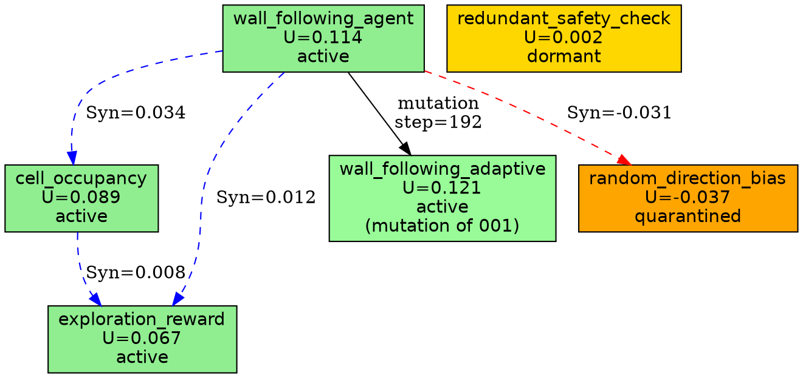

# Frame 3 — Law Ecology + Dead-Law Quarantine Demo
## `demo_03_law_ecology.py`

**Version**: RGPUF v5 Blueprint — Frame 3
**Status**: Specification (pre-implementation)
**Dependencies**: `law_ecology.py`, Frame 1 (`metrics_v5.py`), Frame 2 (`token_economy.py`)
**Output Artifacts**: `law_registry_v5.json`, `law_provenance.jsonl`, `law_ablation.csv`, `law_synergy.csv`, `law_phylogeny.dot`, `law_dashboard.html`, `report_law_ecology.md`

---

## 1. Core Purpose

In RGPUF v4, **laws were decorative names**. A law like `wall_following_agent` existed in the registry, could be activated or deactivated, but had no quantitative measure of its contribution to system performance. There was no way to answer the question "does this law actually help?" Laws accumulated over time, but dead laws (those that contributed nothing or were actively harmful) were never identified or removed. The law registry became a graveyard of well-intentioned but ineffective rules.

**Frame 3 proves that laws are not decorative names — they are testable organisms.** Each law has measurable **utility**, can be **ablated** (temporarily removed) to measure its contribution, can exhibit **synergy** with other laws, can be **quarantined** when harmful, and can **mutate** and **evolve** over generations with full **provenance** tracking.

The ecological metaphor is deliberate:

| Ecological Concept | Law Equivalent |
|---|---|
| **Fitness** | Utility $U(l)$ — how much does the law improve $PR_{strict}$? |
| **Symbiosis** | Synergy $\text{Syn}(l_i, l_j)$ — do two laws perform better together than alone? |
| **Predation** | Negative synergy — does one law undermine another? |
| **Extinction** | Quarantine → Archive — laws that consistently harm performance |
| **Evolution** | Mutation — laws that adapt to changing conditions |
| **Lineage** | Provenance — parent → child relationships across mutation generations |
| **Keystone species** | High-centrality laws whose removal causes cascading failure |
| **Fossil record** | Archived laws preserved with metadata for potential future revival |

---

## 2. What It Demonstrates

Frame 3 runs a micro-world with a populated law registry and periodically:

1. **Runs the full stack** with all active laws
2. **Temporarily disables one law** (ablation test)
3. **Measures** $\Delta PR_{strict}$ to quantify the law's utility
4. **Updates** each law's utility history and contribution decay
5. **Scans pairwise synergy** between all active law pairs
6. **Classifies** each law into one of nine states (see §4)
7. **Acts** on the classification: keep, lease, mutate, quarantine, archive

### 2.1 Key Demonstrations

| Demonstration | What It Proves |
|---|---|
| **Utility measurement** | Every law has a numerically quantified contribution to $PR_{strict}$ |
| **Ablation testing** | Removing a law and measuring the score drop is the gold standard for law evaluation |
| **Synergy detection** | Two individually weak laws can be collectively essential (keystone pairs) |
| **Dead-law quarantine** | Laws with negative utility are automatically quarantined, preventing cumulative harm |
| **Mutation sandbox** | Modified laws are tested in isolation before deployment, preventing catastrophic failures |
| **Provenance tracking** | Every law's lineage (parent, children, birth step, mutation history) is fully recorded |
| **Lineage visualization** | A phylogenetic tree (DOT format) shows the evolutionary history of all laws |

---

## 3. Core Equations

### 3.1 Law Utility

$$U(l) = PR_{strict}(\mathcal{L}) - PR_{strict}(\mathcal{L} \setminus \{l\})$$

Where:
- $\mathcal{L}$ is the current active law set
- $\mathcal{L} \setminus \{l\}$ is the active law set with law $l$ removed
- $PR_{strict}(\mathcal{L})$ is the playable reality score with all active laws
- $PR_{strict}(\mathcal{L} \setminus \{l\})$ is the playable reality score without law $l$

**Interpretation**:
- $U(l) > 0$: Law $l$ is **beneficial** — removing it decreases performance. This is the expected case for well-designed laws.
- $U(l) = 0$: Law $l$ is **neutral** — it has no measurable effect on performance. It is dead weight.
- $U(l) < 0$: Law $l$ is **harmful** — removing it *increases* performance. It is actively undermining the system.

**Computation cost**: Each ablation test requires a full stack run. For $n$ active laws, a complete utility scan requires $n+1$ runs (1 with all laws, $n$ with each law individually removed). This is the most computationally expensive operation in the law ecology system.

**Optimization**: Utility is not recomputed every step. Instead, it is recomputed every $N_{ablation}$ steps (default: $N_{ablation} = 48$). Between ablation cycles, utility is estimated using the contribution decay formula (see Enhancement 22).

### 3.2 Law Synergy

$$\text{Syn}(l_i, l_j) = PR_{strict}(l_i, l_j) - PR_{strict}(l_i) - PR_{strict}(l_j) + PR_{strict}(\emptyset)$$

Where:
- $PR_{strict}(l_i, l_j)$ is the score with both laws $l_i$ and $l_j$ active (and all other active laws)
- $PR_{strict}(l_i)$ is the score with only $l_i$ active (and all other active laws except $l_j$)
- $PR_{strict}(l_j)$ is the score with only $l_j$ active (and all other active laws except $l_i$)
- $PR_{strict}(\emptyset)$ is the score with neither $l_i$ nor $l_j$ active (but all other active laws)

**Interpretation**:
- $\text{Syn}(l_i, l_j) > 0$: **Positive synergy** — the two laws perform better together than the sum of their individual contributions. This is symbiosis.
- $\text{Syn}(l_i, l_j) = 0$: **No synergy** — the laws are independent. Their contributions are purely additive.
- $\text{Syn}(l_i, l_j) < 0$: **Negative synergy** — the two laws interfere with each other. Together they perform worse than expected. This is predation or competition.

**Computation cost**: For $n$ active laws, pairwise synergy requires $\binom{n}{2}$ additional runs. This is expensive for large law sets. Optimization strategies include:
- Only compute synergy for laws with $U(l) > 0$ (skip neutral/negative laws)
- Cache synergy values and recompute less frequently than utility
- Use approximate methods (sampled ablations instead of exhaustive)

### 3.3 Functional Law Cost

$$C_{exec}(\mathcal{L}) = \sum_{l \in \mathcal{L}} \left[ c_{base}(l) + \alpha \cdot \text{runtime}_l + \beta \cdot \text{memory}_l - \gamma \cdot U(l) - \delta \cdot \text{Syn}(l) \right]$$

Where:
- $c_{base}(l)$ is the base execution cost of law $l$
- $\alpha$ is the runtime scaling factor (penalizes slow laws)
- $\text{runtime}_l$ is the measured runtime of law $l$ per step (milliseconds)
- $\beta$ is the memory scaling factor (penalizes memory-heavy laws)
- $\text{memory}_l$ is the measured memory footprint of law $l$ (kilobytes)
- $\gamma$ is the utility discount factor (reward-beneficial laws by reducing their effective cost)
- $U(l)$ is the utility of law $l$ (from §3.1)
- $\delta$ is the synergy discount factor (reward laws that synergize with others)
- $\text{Syn}(l)$ is the maximum synergy of law $l$ with any other active law: $\text{Syn}(l) = \max_{j \neq i} \text{Syn}(l_i, l_j)$

**Key insight**: The cost formula includes **negative terms** for utility and synergy. A highly beneficial law with high utility and strong synergy can have a *negative* effective cost — meaning it pays for itself and subsidizes other laws. This creates a natural incentive structure where the system preferentially retains laws that are both effective and synergistic.

**Category filtering** (see Enhancement 17): Only `physics_laws` and `agent_laws` contribute to $C_{exec}$. Metric heads, report heads, semantic controllers, and novelty laws are excluded from execution cost but still tracked for utility and synergy.

---

## 4. Law States

Every law in the registry exists in exactly one of nine states at any given time:

| State | Description | Transitions |
|---|---|---|
| **`active`** | Law is running in the main loop, contributing to every step | → `leased`, `quarantined`, `dormant`, `mutating` |
| **`leased`** | Law is temporarily activated for a specific repair event with a time limit | → `active` (if lease succeeds), `quarantined` (if lease fails) |
| **`embryo`** | Law has been proposed (by human or mutation) but not yet tested | → `active` (if first utility test > 0), `quarantined` (if utility ≤ 0) |
| **`dormant`** | Law is not running, has zero utility, but is not harmful. Preserved for possible future use. | → `active` (if context matches), `archived` (if dormant too long), `quarantined` (if utility drops below 0) |
| **`quarantined`** | Law has been flagged as harmful (negative utility). Not running. Under observation. | → `dormant` (if re-evaluated as neutral), `archived` (if quarantine expires), `active` (if context changes and law becomes beneficial) |
| **`archived`** | Law is permanently retired. Not running. Moved to fossil record. | → `active` (rare: manual revival or matching revival condition) |
| **`mutating`** | Law is currently being modified in the sandbox. Not running in main loop. | → `active` (if mutation passes sandbox tests), `quarantined` (if mutation fails) |
| **`fossilized`** | Archived law that has been moved to the fossil record with full metadata. | → `active` (only via explicit revival protocol) |

### 4.1 State Transition Rules

**Activation conditions** (any one triggers transition to `active`):
- Embryo passes first utility test ($U(l) > \theta_{embryo}$, default 0.01)
- Dormant law's context matches current failure pattern (see Enhancement 21)
- Quarantined law is re-evaluated and found beneficial
- Mutation passes sandbox validation
- Manual activation by human operator

**Deactivation conditions** (any one triggers transition away from `active`):
- Utility drops below quarantine threshold ($U(l) < -\theta_{quarantine}$, default -0.01) for $N_{consecutive}$ consecutive ablation cycles
- Execution cost exceeds budget ($C_{exec}(l) > C_{budget}$) and utility is below replacement threshold
- Manual deactivation by human operator

**Quarantine conditions**:
- $U(l) < -\theta_{quarantine}$ for $N_{consecutive} = 3$ consecutive ablation cycles
- Law causes a critical failure (crash, infinite loop, unbounded variable) during execution
- Law's negative synergy with a keystone law exceeds a threshold

**Archive conditions**:
- Law has been quarantined for more than $N_{archive}$ steps (default: $N_{archive} = 240$)
- Law's utility history shows no positive utility in the last $N_{archive}$ steps
- Manual archival by human operator

---

## 5. Law Metadata

Every law in the registry is represented as a JSON object with the following schema:

```json
{
  "law_id": "law_wall_follow_001",
  "law_name": "wall_following_agent",
  "category": "agent_law",
  "source": "human",
  "parent_laws": [],
  "child_laws": ["law_wall_follow_adaptive_002"],
  "birth_step": 0,
  "birth_mode": "colony",
  "last_mutation_step": null,
  "last_utility_measurement_step": 48,
  "activation_reason": "colony_loop_detected",
  "last_utility": 0.114,
  "utility_history": [0.021, 0.067, 0.098, 0.114],
  "utility_history_steps": [12, 24, 36, 48],
  "synergy_partners": ["cell_occupancy", "exploration_reward"],
  "synergy_values": {"cell_occupancy": 0.034, "exploration_reward": 0.012},
  "failure_cases": ["open_field_no_walls", "dynamic_obstacles"],
  "quarantine_count": 0,
  "quarantine_history": [],
  "mutation_count": 0,
  "mutation_history": [],
  "state": "active",
  "base_cost": 0.002,
  "runtime_ms": 0.15,
  "memory_kb": 12,
  "complexity": 3,
  "effective_cost": -0.009,
  "description": "Follows walls to navigate colony grid, preventing open-field wandering and loop traps",
  "code_hash": "b7c9e2a1f4d63805",
  "lease_count": 0,
  "lease_success_count": 0,
  "total_contribution_pr": 0.114,
  "keystone_score": 0.028,
  "revival_condition": null
}
```

### 5.1 Field Definitions

| Field | Type | Description |
|---|---|---|
| `law_id` | `str` | Unique identifier (UUID or sequential) |
| `law_name` | `str` | Human-readable name |
| `category` | `str` | One of: `physics_law`, `agent_law`, `metric_head`, `report_head`, `semantic_controller`, `novelty_law` |
| `source` | `str` | Origin: `human`, `mutation`, `synthesis`, `import` |
| `parent_laws` | `list[str]` | IDs of laws this law was derived from |
| `child_laws` | `list[str]` | IDs of laws derived from this law |
| `birth_step` | `int` | Step at which this law was created |
| `birth_mode` | `str` | Mode in which this law was born |
| `last_mutation_step` | `int/null` | Step of most recent mutation |
| `last_utility_measurement_step` | `int` | Step of most recent utility computation |
| `activation_reason` | `str` | Why this law was activated |
| `last_utility` | `float` | Most recent utility measurement |
| `utility_history` | `list[float]` | Historical utility values |
| `utility_history_steps` | `list[int]` | Steps at which utility was measured |
| `synergy_partners` | `list[str]` | Names of laws with positive synergy |
| `synergy_values` | `dict[str,float]` | Pairwise synergy magnitudes |
| `failure_cases` | `list[str]` | Known contexts where this law fails |
| `quarantine_count` | `int` | Number of times this law has been quarantined |
| `quarantine_history` | `list[dict]` | Detailed quarantine records |
| `mutation_count` | `int` | Number of times this law has been mutated |
| `mutation_history` | `list[dict]` | Detailed mutation records |
| `state` | `str` | Current state (one of nine states in §4) |
| `base_cost` | `float` | Base execution cost |
| `runtime_ms` | `float` | Measured runtime per step |
| `memory_kb` | `float` | Measured memory footprint |
| `complexity` | `int` | Complexity metric (condition count, nesting depth) |
| `effective_cost` | `float` | Cost after utility/synergy discounts |
| `description` | `str` | Human-readable description |
| `code_hash` | `str` | Hash of the law's source code |
| `lease_count` | `int` | Total times leased for repair |
| `lease_success_count` | `int` | Times lease improved PR_strict |
| `total_contribution_pr` | `float` | Cumulative PR_strict contribution over lifetime |
| `keystone_score` | `float` | Centrality in the epistasis graph (see Enhancement 19) |
| `revival_condition` | `str/null` | Condition under which a dormant/archived law can be revived |

---

## 6. Demo Mechanics

Frame 3 runs a micro-world (default: `colony` mode, which has the richest law ecosystem) with a pre-populated law registry. The demo cycle proceeds as follows:

### 6.1 Initialization

1. Load initial law registry from `law_registry_v5.json` (contains 10–15 pre-defined laws spanning all six categories)
2. Initialize all laws in their specified states
3. Set up the micro-world with controlled breakdown schedule (similar to Frame 2)

### 6.2 Main Loop (Every Step)

1. **Execute active laws**: Run all laws in the `active` state in priority order
2. **Compute metrics**: Calculate $PR_{strict}$, $D_A$, $\rho_{fair}$, $P_{stag}$, and all other Frame 1 metrics
3. **Detect surprises**: Apply Frame 2's harmful surprise filter
4. **Process repairs**: If harmful surprise detected, run repair auction and activate lease
5. **Log telemetry**: Write one row per step to CSV

### 6.3 Ablation Cycle (Every $N_{ablation} = 48$ Steps)

At each ablation cycle boundary:

**Step 1: Full-stack baseline**
- Run the micro-world for $W_{ablation} = 24$ steps with all active laws
- Record $PR_{strict}(\mathcal{L})$ as the baseline

**Step 2: Per-law ablation**
- For each active law $l \in \mathcal{L}_{active}$:
  - Run the micro-world for $W_{ablation} = 24$ steps with $l$ removed
  - Record $PR_{strict}(\mathcal{L} \setminus \{l\})$
  - Compute $U(l) = PR_{strict}(\mathcal{L}) - PR_{strict}(\mathcal{L} \setminus \{l\})$
  - Update $l$'s utility history and contribution decay

**Step 3: Pairwise synergy scan**
- For each pair of active laws $(l_i, l_j)$ where both have $U > 0$:
  - Run with both laws present: $PR_{strict}(l_i, l_j)$
  - Run with only $l_i$: $PR_{strict}(l_i)$
  - Run with only $l_j$: $PR_{strict}(l_j)$
  - Run with neither: $PR_{strict}(\emptyset)$
  - Compute $\text{Syn}(l_i, l_j)$
  - Update synergy records

**Step 4: State classification**
- For each law, apply state transition rules (see §4.1):
  - Active with $U > 0$: remain `active`
  - Active with $U < -\theta_{quarantine}$ for 3+ cycles: → `quarantined`
  - Active with $U = 0$ for 2+ cycles: → `dormant`
  - Quarantined for > $N_{archive}$ steps: → `archived` → `fossilized`
  - Dormant with matching failure context: → `active`

**Step 5: Execution cost update**
- Recompute $C_{exec}(\mathcal{L})$ using §3.3
- Check budget constraint: $C_{exec}(\mathcal{L}) < C_{budget}$
- If over budget, deactivate the law with the lowest utility-to-cost ratio

### 6.4 Mutation Cycle (Every $N_{mutation} = 96$ Steps)

At each mutation cycle boundary:

1. **Select mutation candidate**: Choose the active law with the highest complexity-to-utility ratio (most complex, least effective) or a law with declining utility trend
2. **Generate mutation**: Apply random perturbation to the law's parameters/conditions (see Enhancement 20)
3. **Sandbox test**: Run the mutated law in a forked micro-world for $W_{sandbox} = 48$ steps
4. **Evaluate**: Compare mutated law's $PR_{strict}$ against original
5. **Accept/reject**:
   - Accept if: $PR_{strict}^{mutated} > PR_{strict}^{original} \cdot (1 + \theta_{mutation})$ (at least $\theta_{mutation}$ improvement, default 5%)
   - Accept if: $PR_{strict}^{mutated} > 0$ and original has been declining for 3+ cycles ( desperation clause)
   - Reject otherwise
6. **Record provenance**: Update parent_laws, child_laws, mutation_history

### 6.5 Example Law Registry (Initial State)

```json
{
  "version": "5.0.0",
  "created": "2025-01-01T00:00:00Z",
  "modes": ["colony"],
  "laws": [
    {
      "law_id": "law_wall_follow_001",
      "law_name": "wall_following_agent",
      "category": "agent_law",
      "source": "human",
      "parent_laws": [],
      "child_laws": [],
      "birth_step": 0,
      "birth_mode": "colony",
      "last_mutation_step": null,
      "last_utility_measurement_step": null,
      "activation_reason": "colony_loop_detected",
      "last_utility": null,
      "utility_history": [],
      "utility_history_steps": [],
      "synergy_partners": [],
      "synergy_values": {},
      "failure_cases": [],
      "quarantine_count": 0,
      "quarantine_history": [],
      "mutation_count": 0,
      "mutation_history": [],
      "state": "active",
      "base_cost": 0.002,
      "runtime_ms": null,
      "memory_kb": null,
      "complexity": 3,
      "effective_cost": null,
      "description": "Follows walls to navigate colony grid, preventing open-field wandering and loop traps",
      "code_hash": null,
      "lease_count": 0,
      "lease_success_count": 0,
      "total_contribution_pr": 0.0,
      "keystone_score": null,
      "revival_condition": null
    },
    {
      "law_id": "law_cell_occupy_002",
      "law_name": "cell_occupancy",
      "category": "physics_law",
      "source": "human",
      "parent_laws": [],
      "child_laws": [],
      "birth_step": 0,
      "birth_mode": "colony",
      "last_mutation_step": null,
      "last_utility_measurement_step": null,
      "activation_reason": "initial_setup",
      "last_utility": null,
      "utility_history": [],
      "utility_history_steps": [],
      "synergy_partners": [],
      "synergy_values": {},
      "failure_cases": [],
      "quarantine_count": 0,
      "quarantine_history": [],
      "mutation_count": 0,
      "mutation_history": [],
      "state": "active",
      "base_cost": 0.001,
      "runtime_ms": null,
      "memory_kb": null,
      "complexity": 1,
      "effective_cost": null,
      "description": "Tracks which cells are occupied, prevents double-occupancy collisions",
      "code_hash": null,
      "lease_count": 0,
      "lease_success_count": 0,
      "total_contribution_pr": 0.0,
      "keystone_score": null,
      "revival_condition": null
    },
    {
      "law_id": "law_explore_reward_003",
      "law_name": "exploration_reward",
      "category": "metric_head",
      "source": "human",
      "parent_laws": [],
      "child_laws": [],
      "birth_step": 0,
      "birth_mode": "colony",
      "last_mutation_step": null,
      "last_utility_measurement_step": null,
      "activation_reason": "initial_setup",
      "last_utility": null,
      "utility_history": [],
      "utility_history_steps": [],
      "synergy_partners": [],
      "synergy_values": {},
      "failure_cases": [],
      "quarantine_count": 0,
      "quarantine_history": [],
      "mutation_count": 0,
      "mutation_history": [],
      "state": "active",
      "base_cost": 0.001,
      "runtime_ms": null,
      "memory_kb": null,
      "complexity": 2,
      "effective_cost": null,
      "description": "Provides reward signal for visiting unexplored cells",
      "code_hash": null,
      "lease_count": 0,
      "lease_success_count": 0,
      "total_contribution_pr": 0.0,
      "keystone_score": null,
      "revival_condition": null
    },
    {
      "law_id": "law_dead_weight_004",
      "law_name": "redundant_safety_check",
      "category": "agent_law",
      "source": "human",
      "parent_laws": [],
      "child_laws": [],
      "birth_step": 0,
      "birth_mode": "colony",
      "last_mutation_step": null,
      "last_utility_measurement_step": null,
      "activation_reason": "initial_setup",
      "last_utility": null,
      "utility_history": [],
      "utility_history_steps": [],
      "synergy_partners": [],
      "synergy_values": {},
      "failure_cases": [],
      "quarantine_count": 0,
      "quarantine_history": [],
      "mutation_count": 0,
      "mutation_history": [],
      "state": "active",
      "base_cost": 0.003,
      "runtime_ms": null,
      "memory_kb": null,
      "complexity": 5,
      "effective_cost": null,
      "description": "Performs a redundant safety check that duplicates cell_occupancy law. Should have near-zero utility. Intentionally included as a dead-law candidate.",
      "code_hash": null,
      "lease_count": 0,
      "lease_success_count": 0,
      "total_contribution_pr": 0.0,
      "keystone_score": null,
      "revival_condition": null
    },
    {
      "law_id": "law_harmful_override_005",
      "law_name": "random_direction_bias",
      "category": "agent_law",
      "source": "human",
      "parent_laws": [],
      "child_laws": [],
      "birth_step": 0,
      "birth_mode": "colony",
      "last_mutation_step": null,
      "last_utility_measurement_step": null,
      "activation_reason": "initial_setup",
      "last_utility": null,
      "utility_history": [],
      "utility_history_steps": [],
      "synergy_partners": [],
      "synergy_values": {},
      "failure_cases": [],
      "quarantine_count": 0,
      "quarantine_history": [],
      "mutation_count": 0,
      "mutation_history": [],
      "state": "active",
      "base_cost": 0.001,
      "runtime_ms": null,
      "memory_kb": null,
      "complexity": 2,
      "effective_cost": null,
      "description": "Biases the agent's direction randomly, interfering with purposeful exploration. Should have negative utility. Intentionally included as a quarantine candidate.",
      "code_hash": null,
      "lease_count": 0,
      "lease_success_count": 0,
      "total_contribution_pr": 0.0,
      "keystone_score": null,
      "revival_condition": null
    }
  ]
}
```

The registry includes two intentionally problematic laws:
- **`redundant_safety_check`**: A dead law with near-zero utility — should transition to `dormant`
- **`random_direction_bias`**: A harmful law with negative utility — should transition to `quarantined`

---

## 7. Expected Result

### 7.1 Law State Evolution

Over a 480-step run (10 ablation cycles), the expected state transitions are:

| Law | Initial State | After Cycle 3 | After Cycle 5 | After Cycle 10 | Final State |
|---|---|---|---|---|---|
| `wall_following_agent` | `active` | `active` ($U > 0$) | `active` | `active` | `active` |
| `cell_occupancy` | `active` | `active` ($U > 0$) | `active` | `active` | `active` |
| `exploration_reward` | `active` | `active` ($U > 0$) | `active` | `active` | `active` |
| `redundant_safety_check` | `active` | `active` ($U \approx 0$) | `dormant` ($U = 0$ for 2 cycles) | `dormant` | `archived` → `fossilized` |
| `random_direction_bias` | `active` | `quarantined` ($U < 0$ for 3 cycles) | `quarantined` | `archived` → `fossilized` | `fossilized` |

### 7.2 Synergy Detection

Expected positive synergies:
- `wall_following_agent` ↔ `cell_occupancy`: Wall following relies on knowing which cells are occupied. Removing either degrades the other. Expected $\text{Syn} > 0.02$.
- `exploration_reward` ↔ `wall_following_agent`: Exploration reward incentivizes wall following by making new cell discovery valuable. Expected $\text{Syn} > 0.01$.

Expected negative synergy:
- `random_direction_bias` ↔ `wall_following_agent`: Random bias directly undermines wall-following behavior. Expected $\text{Syn} < -0.03$.

### 7.3 Playable Reality Evolution

$$PR_{strict}(\text{with all beneficial laws}) > PR_{strict}(\text{after dead laws removed}) \approx PR_{strict}(\text{after harmful laws quarantined}) \gg PR_{strict}(\text{initial with harmful laws})$$

The key result is that **quarantining harmful laws improves performance** — the system self-heals by identifying and removing its own worst components. This is the "autonomic immune response" of the law ecology.

### 7.4 Metric Head Promotion

`playable_reality` is a metric_head category law. In v5, `playable_reality` is promoted from a simple scoring function to a `metric_head` with full ecological status. This means:
- It has a utility score (does the scoring function itself help the system?)
- It has synergy partners (does it work well with other metric heads?)
- It can be mutated (can the scoring formula be improved by the system itself?)
- It has provenance (who wrote it, when was it last changed, what was changed?)

---

## 8. Build Files

```
examples/core_tier/v5_demo_03/
├── demo_03_law_ecology.py        # Main demo runner
├── law_ecology.py                 # Law ecology implementation
├── law_registry_v5.json           # Initial law registry with metadata
├── law_provenance.jsonl           # Provenance event log (JSON Lines)
├── law_ablation.csv               # Per-cycle ablation results
├── law_synergy.csv                # Pairwise synergy measurements
├── law_phylogeny.dot              # Graphviz DOT file for law lineage tree
├── law_dashboard.html             # Interactive law ecology dashboard
└── report_law_ecology.md          # Auto-generated analysis report
```

### 8.1 File Descriptions

**`demo_03_law_ecology.py`** — Main entry point. Accepts `--mode`, `--seed`, `--steps`, `--registry`, `--config` arguments. Loads the initial law registry, runs the main loop with ablation and mutation cycles, and produces all output artifacts.

**`law_ecology.py`** — Pure Python module implementing the law ecology system:
- `Law` class with full metadata, state machine, and utility tracking
- `LawRegistry` class managing all laws, state transitions, and provenance
- `compute_utility(law, full_laws, world, n_steps)` → `float`
- `compute_synergy(law_a, law_b, other_laws, world, n_steps)` → `float`
- `compute_exec_cost(active_laws)` → `float`
- `run_ablation_cycle(registry, world, n_ablation_steps)` → `dict`
- `run_mutation_cycle(registry, world, n_sandbox_steps)` → `Law or None`
- `classify_law_state(law, utility_history, quarantine_thresholds)` → `str`
- `transition_law_state(law, new_state, reason)` → `None`
- `export_phylogeny_dot(registry)` → `str` (DOT format)

**`law_registry_v5.json`** — JSON file containing the full initial law registry. See §6.5 for the schema and example.

**`law_provenance.jsonl`** — JSON Lines file recording every state transition, mutation, ablation result, and utility update. Each line is a structured event:

```json
{"event": "birth", "step": 0, "law_id": "law_wall_follow_001", "source": "human", "parent_laws": [], "mode": "colony"}
{"event": "utility_measurement", "step": 48, "law_id": "law_wall_follow_001", "utility": 0.114, "pr_full": 0.142, "pr_ablated": 0.028}
{"event": "state_transition", "step": 240, "law_id": "law_dead_weight_004", "from": "active", "to": "dormant", "reason": "zero_utility_2_cycles"}
{"event": "quarantine", "step": 144, "law_id": "law_harmful_override_005", "reason": "negative_utility_3_cycles", "utility": -0.037}
{"event": "mutation", "step": 192, "law_id": "law_wall_follow_adaptive_002", "parent": "law_wall_follow_001", "mutation_type": "parameter_tune", "utility_before": 0.098, "utility_after": 0.121}
{"event": "archive", "step": 384, "law_id": "law_harmful_override_005", "reason": "quarantine_expired", "final_utility": -0.041}
```

**`law_ablation.csv`** — Per-cycle ablation results:

```csv
cycle,step,law_id,law_name,category,state,utility,pr_full,pr_ablated,delta_pr,runtime_ms,memory_kb,base_cost,effective_cost
1,48,law_wall_follow_001,wall_following_agent,agent_law,active,0.114,0.142,0.028,0.114,0.15,12,0.002,-0.009
1,48,law_cell_occupy_002,cell_occupancy,physics_law,active,0.089,0.142,0.053,0.089,0.08,4,0.001,-0.006
1,48,law_explore_reward_003,exploration_reward,metric_head,active,0.067,0.142,0.075,0.067,0.10,8,0.001,-0.004
1,48,law_dead_weight_004,redundant_safety_check,agent_law,active,0.002,0.142,0.140,0.002,0.22,16,0.003,0.002
1,48,law_harmful_override_005,random_direction_bias,agent_law,active,-0.037,0.142,0.179,-0.037,0.05,2,0.001,0.001
```

**`law_synergy.csv`** — Pairwise synergy measurements:

```csv
cycle,step,law_a,law_b,syn_a_b,pr_both,pr_a_only,pr_b_only,pr_neither
1,48,law_wall_follow_001,law_cell_occupy_002,0.034,0.142,0.089,0.053,0.028
1,48,law_wall_follow_001,law_explore_reward_003,0.012,0.142,0.075,0.098,0.042
1,48,law_cell_occupy_002,law_explore_reward_003,0.008,0.142,0.075,0.053,0.042
1,48,law_wall_follow_001,law_harmful_override_005,-0.031,0.142,0.179,0.028,0.142
```

**`law_phylogeny.dot`** — Graphviz DOT file for law lineage visualization:



**`law_dashboard.html`** — Self-contained HTML dashboard (no external dependencies) showing:
- Law state distribution (pie chart: active, dormant, quarantined, archived, etc.)
- Utility bar chart for all laws (color-coded by state)
- Synergy matrix heatmap (laws × laws, green = positive, red = negative)
- State transition timeline (Gantt-style: each law as a row, colored segments for each state)
- Execution cost breakdown (stacked bar: base_cost, runtime, memory, utility_discount, synergy_discount)
- Phylogeny tree (rendered from DOT file using embedded Graphviz or SVG)
- Fossil record (table of archived laws with metadata)

**`report_law_ecology.md`** — Auto-generated Markdown report summarizing:
- Initial and final law registry state
- All state transitions with reasons
- Utility ranking and evolution
- Synergy analysis (strongest positive and negative pairs)
- Mutation history and outcomes
- Execution cost breakdown
- Recommendations for law addition, removal, or modification

---

## 9. Integrated Enhancements 17–24

### Enhancement 17: Law Category Separation

**Purpose**: Not all laws are created equal. Physics laws and agent laws directly affect the simulation and should be subject to execution cost budgets. Metric heads, report heads, semantic controllers, and novelty laws serve auxiliary functions and should not compete for the same cost budget.

**Implementation**: Six law categories with distinct treatment:

| Category | Counts Toward $C_{exec}$? | Subject to Ablation? | Subject to Mutation? |
|---|---|---|---|
| `physics_law` | **Yes** | Yes | Yes |
| `agent_law` | **Yes** | Yes | Yes |
| `metric_head` | No | Yes | Yes |
| `report_head` | No | No | No |
| `semantic_controller` | No | Yes | Rare |
| `novelty_law` | No | Yes | Yes |

**Rationale**:
- `physics_law` and `agent_law` directly modify the simulation state and have runtime/memory costs. They compete for the execution budget.
- `metric_head` includes scoring functions like `playable_reality`. These are informational and should be evaluated for utility (does this scoring function help?) but not penalized for runtime.
- `report_head` includes report generation laws. These are output-only and should not be subject to ecological pressure.
- `semantic_controller` manages the world model and language grounding. These are infrastructure and rarely need mutation.
- `novelty_law` manages novelty detection. These are important but auxiliary.

**Impact on $C_{exec}$**: The cost formula (§3.3) sums only over `physics_law` and `agent_law` categories:

$$C_{exec}(\mathcal{L}) = \sum_{l \in \mathcal{L}_{physics} \cup \mathcal{L}_{agent}} \left[ c_{base}(l) + \alpha \cdot \text{runtime}_l + \beta \cdot \text{memory}_l - \gamma \cdot U(l) - \delta \cdot \text{Syn}(l) \right]$$

### Enhancement 18: Law Pedigree Tracking

**Purpose**: Enable full genealogical analysis of law evolution. Every law's ancestry should be traceable to its origin, whether human-authored or machine-generated.

**Implementation**: Each law maintains a **pedigree record**:

```json
{
  "pedigree": {
    "law_id": "law_wall_follow_adaptive_002",
    "generation": 1,
    "ancestry": [
      {
        "law_id": "law_wall_follow_001",
        "relationship": "parent",
        "mutation_step": 192,
        "mutation_type": "parameter_tune",
        "parameters_changed": ["wall_detection_radius", "corner_handling_strategy"]
      }
    ],
    "descendants": [],
    "origin": {
      "type": "mutation",
      "source_law": "law_wall_follow_001",
      "creator": "system",
      "reason": "utility_decline_detected",
      "birth_step": 192,
      "birth_mode": "colony"
    }
  }
}
```

**Generation tracking**: The `generation` field increments with each mutation. Human-authored laws start at generation 0. First mutation → generation 1, second mutation → generation 2, etc. Laws with high generation numbers have been heavily refined by the system; laws still at generation 0 are either optimal as-is or have not yet been subjected to evolutionary pressure.

**Cross-pollination**: When a law is synthesized from two parent laws (not just mutated from one), both parents are listed in the ancestry, and the generation is `max(parent1.generation, parent2.generation) + 1`.

### Enhancement 19: Epistasis Graph

**Purpose**: Map the interaction network between all laws. Laws are not independent — their effects on $PR_{strict}$ are modulated by the presence or absence of other laws. The epistasis graph makes these interactions visible and quantifiable.

**Implementation**: A weighted undirected graph $G = (V, E)$ where:
- $V = \{l_1, l_2, \ldots, l_n\}$ is the set of all laws (all categories, all states)
- $E = \{(l_i, l_j) \mid |\text{Syn}(l_i, l_j)| > \theta_{syn}\}$ is the set of edges between laws with significant synergy
- Edge weight: $w(l_i, l_j) = \text{Syn}(l_i, l_j)$ (positive = green, negative = red)

**Keystone laws**: Computed using graph centrality metrics:
- **Degree centrality**: Number of significant synergy partners. Laws with high degree interact with many other laws.
- **Betweenness centrality**: Frequency of appearing on shortest paths between other law pairs. Laws with high betweenness are "bridges" that connect otherwise disconnected clusters.
- **Weighted degree**: Sum of absolute synergy values. Laws with high weighted degree have the strongest total interactions.

$$\text{Keystone}(l) = \frac{\text{degree}(l) + \text{betweenness}(l) + \text{weighted\_degree}(l)}{3}$$

Laws with $\text{Keystone}(l) > \theta_{keystone}$ are flagged as **keystone laws**. Removal of a keystone law causes cascading failures across the law ecosystem. These laws receive extra protection from quarantine and are given priority in the execution budget.

**Clustering**: The graph can be partitioned into clusters using community detection (e.g., Louvain method). Laws in the same cluster serve related functions; laws in different clusters serve independent functions. This information guides mutation (mutating within a cluster is safer than across clusters) and quarantine (quarantining a law affects only its cluster).

### Enhancement 20: Law Mutation Sandbox

**Purpose**: Mutating laws in the live system is dangerous. A bad mutation could crash the simulation, corrupt state, or cause unbounded resource consumption. The sandbox provides a safe testing environment.

**Implementation**: When a law $l$ is selected for mutation:

1. **Fork the micro-world**: Create a copy of the current world state
2. **Generate variant**: Apply mutation operator (see below) to produce $l'$
3. **Run in sandbox**: Execute $l'$ in the forked world for $W_{sandbox} = 48$ steps
4. **Evaluate**: Compare $PR_{strict}$ with $l'$ vs $PR_{strict}$ with $l$
5. **Safety checks**: Apply rejection criteria (see below)
6. **Accept or reject**: Replace $l$ with $l'$ if passed; discard $l'$ if failed

**Mutation operators**:
- `parameter_tune`: Randomly adjust numeric parameters within ±20% of current value
- `condition_add`: Add a new conditional branch to the law
- `condition_remove`: Remove an existing conditional branch (if complexity > 2)
- `threshold_adjust`: Move comparison thresholds by ±10%
- `logic_negate`: Negate a boolean condition (risky — may produce opposite behavior)
- `cross_breed`: Combine elements from two different laws (synthesis)

**Rejection criteria** (any one causes rejection):
| Criterion | Threshold | Reason |
|---|---|---|
| Catastrophic failure | Any crash, exception, or assertion failure | Law is broken |
| Syntax failure | Law fails to parse or compile | Law is malformed |
| Unbounded variable | Any variable exceeds $10^6$ or drops below $-10^6$ | Law has runaway dynamics |
| $PR_{strict}$ collapse | $PR_{strict}^{mutated} < 0.5 \cdot PR_{strict}^{original}$ | Law is catastrophically worse |
| Risk spike | $R_{risk}$ increases by > 50% | Law introduces danger |
| Runtime blowup | Runtime exceeds $10 \times$ original | Law is too expensive |
| Memory blowup | Memory exceeds $10 \times$ original | Law is too memory-hungry |

**Rejected mutations are logged** in the provenance with the rejection reason, enabling analysis of common failure modes.

### Enhancement 21: Dormant Law Cryo-Storage

**Purpose**: Quarantined and dormant laws consume registry space and cognitive overhead. Cryo-storage compresses these laws into a zero-import pool that is invisible during normal operation but searchable during failure recovery.

**Implementation**: A directory `dormant_pool/` contains compressed representations of non-active laws:

```
dormant_pool/
├── quarantine/
│   ├── law_harmful_override_005.json.gz
│   └── law_bad_collision_007.json.gz
├── dormant/
│   ├── law_dead_weight_004.json.gz
│   └── law_obsolete_path_008.json.gz
└── archived/
    ├── law_v4_legacy_001.json.gz
    └── law_deprecated_reward_002.json.gz
```

**Compression**: Each law's metadata is serialized to JSON and gzip-compressed. The compressed size is typically < 1KB per law, making the dormant pool negligibly small even with hundreds of archived laws.

**Resurrection**: When the system encounters a failure context that matches a dormant law's `failure_cases` or `revival_condition`, the dormant law is decompressed and proposed for re-activation. The resurrection process follows the same embryo → active pipeline as a new law, requiring a positive utility test before full activation.

**Matching algorithm**: Resurrection matching uses a simple keyword-overlap score between the current failure description and the dormant law's `failure_cases` and `description`:

$$\text{Match}(l, \text{failure}) = \frac{|\text{keywords}(l) \cap \text{keywords}(\text{failure})|}{|\text{keywords}(l) \cup \text{keywords}(\text{failure})|}$$

If $\text{Match}(l, \text{failure}) > \theta_{revival}$ (default: 0.3), the law is proposed for resurrection.

### Enhancement 22: Law Contribution Decay

**Purpose**: Prevent ancient success from protecting obsolete laws. A law that was highly useful 200 steps ago but has contributed nothing recently should not retain its historical utility as a shield against quarantine.

**Implementation**: Exponential moving average of utility:

$$U_t(l) = \alpha \cdot U_{t-1}(l) + (1 - \alpha) \cdot U_{current}(l)$$

Where:
- $\alpha = 0.7$ (default) — gives 70% weight to history, 30% to current measurement
- $U_{current}(l)$ is the raw utility measured in the current ablation cycle
- $U_t(l)$ is the decayed utility used for state classification

**Behavior over time**:
- If $U_{current} = U_{t-1}$ (consistent utility): $U_t = U_{t-1}$ (no change)
- If $U_{current} > U_{t-1}$ (improving): $U_t$ slowly rises toward $U_{current}$
- If $U_{current} = 0$ (recently useless): $U_t$ decays: after 5 cycles of $U=0$, $U_t = 0.7^5 \cdot U_0 \approx 0.168 \cdot U_0$
- If $U_{current} < 0$ (recently harmful): $U_t$ decays rapidly toward negative

**Quarantine threshold with decay**: A law is quarantined when $U_t(l) < -\theta_{quarantine}$ for $N_{consecutive} = 3$ cycles. With decay, a law that was previously beneficial but recently became harmful will reach quarantine faster than without decay (because the decayed value crosses the threshold sooner).

**Half-life**: The effective half-life of utility is $\log(0.5) / \log(\alpha) \approx 1.94$ cycles at $\alpha = 0.7$. This means utility halves roughly every 2 ablation cycles (~96 steps), ensuring that stale utility fades within a reasonable timeframe.

### Enhancement 23: Law Safety Sandbox

**Purpose**: Laws execute arbitrary code within the simulation. Without safety checks, a buggy or malicious law could cause infinite loops, out-of-memory errors, unsafe system access, or unbounded computation. The safety sandbox wraps every law execution in protective checks.

**Implementation**: Every law execution is wrapped in a safety context manager:

```python
class LawSafetySandbox:
    """Wraps law execution with runtime safety checks."""

    def __init__(self, law, max_runtime_ms=100, max_memory_kb=1024,
                 max_variable_value=1e6, max_loop_iterations=10000):
        self.law = law
        self.max_runtime_ms = max_runtime_ms
        self.max_memory_kb = max_memory_kb
        self.max_variable_value = max_variable_value
        self.max_loop_iterations = max_loop_iterations

    def execute(self, world_state):
        """Execute law with safety checks. Returns (result, safety_report)."""
        start_time = time.monotonic()
        memory_before = get_memory_usage()

        try:
            # Set up resource limits
            set_resource_limits(
                max_cpu_time=self.max_runtime_ms / 1000,
                max_memory_bytes=self.max_memory_kb * 1024
            )

            # Check for unsafe imports
            self._check_imports()

            # Execute law
            result = self.law.apply(world_state)

            # Check result for bounded values
            self._check_bounded_values(world_state)

            elapsed = (time.monotonic() - start_time) * 1000
            memory_after = get_memory_usage()

            safety_report = {
                "law_id": self.law.law_id,
                "status": "safe",
                "runtime_ms": elapsed,
                "memory_delta_kb": memory_after - memory_before,
                "violations": []
            }

            return result, safety_report

        except TimeoutError:
            return None, {"law_id": self.law.law_id, "status": "violation",
                          "violation": "runtime_exceeded", "limit_ms": self.max_runtime_ms}
        except MemoryError:
            return None, {"law_id": self.law.law_id, "status": "violation",
                          "violation": "memory_exceeded", "limit_kb": self.max_memory_kb}
        except ValueError as e:
            return None, {"law_id": self.law.law_id, "status": "violation",
                          "violation": "unbounded_value", "detail": str(e)}

    def _check_imports(self):
        """Block unsafe imports (os, sys, subprocess, etc.)."""
        FORBIDDEN_MODULES = {
            'os', 'sys', 'subprocess', 'shutil', 'pathlib',
            'socket', 'http', 'urllib', 'requests',
            'ctypes', 'multiprocessing', 'threading',
            'eval', 'exec', 'compile', '__import__'
        }
        source = inspect.getsource(self.law.apply)
        for module in FORBIDDEN_MODULES:
            if f'import {module}' in source or f'from {module}' in source:
                raise SecurityError(f"Forbidden import: {module}")

    def _check_bounded_values(self, world_state):
        """Check that all state values are within bounds."""
        for key, value in world_state.items():
            if isinstance(value, (int, float)):
                if abs(value) > self.max_variable_value:
                    raise ValueError(
                        f"Unbounded variable {key}={value} "
                        f"(limit: ±{self.max_variable_value})"
                    )
```

**Safety violations** are logged and counted toward the law's quarantine score. Three safety violations within $N_{ablation}$ steps trigger automatic quarantine, regardless of utility.

### Enhancement 24: Law Fossil Record

**Purpose**: Archived laws are not deleted — they are fossilized. The fossil record preserves the complete history of every law that has been retired, including why it was removed, what it contributed during its lifetime, and what conditions might warrant its revival.

**Implementation**: When a law transitions to `archived` → `fossilized`, a fossil record entry is created:

```json
{
  "fossil_id": "fossil_001",
  "law_id": "law_harmful_override_005",
  "law_name": "random_direction_bias",
  "category": "agent_law",
  "fossilized_step": 384,
  "lifetime_steps": 384,
  "state_history": {
    "active": {"start": 0, "end": 144, "duration": 144},
    "quarantined": {"start": 144, "end": 384, "duration": 240}
  },
  "final_utility": -0.041,
  "peak_utility": 0.003,
  "mean_utility": -0.021,
  "utility_history": [0.003, -0.012, -0.025, -0.037, -0.041],
  "total_contribution_pr": -4.102,
  "quarantine_reason": "negative_utility_3_cycles",
  "archive_reason": "quarantine_expired_240_steps",
  "failure_contexts": [
    "colony_open_field_exploration",
    "colony_resource_collection",
    "colony_path_optimization"
  ],
  "parent_lineage": [],
  "child_lineage": [],
  "mutation_history": [],
  "revival_condition": "If random exploration is explicitly desired and wall_following_agent is disabled, this law could provide useful stochastic behavior. Requires manual approval.",
  "lessons_learned": [
    "Random direction bias undermines purposeful exploration",
    "Negative synergy with wall_following_agent is strong (Syn=-0.031)",
    "Cost of maintaining this law (quarantine overhead, ablation testing) exceeded its potential future value"
  ],
  "compressed_metadata": "base64:gzip:..."
}
```

**Fossil record features**:
- **Complete lifetime summary**: From birth to fossilization, every state transition and utility measurement
- **Failure context documentation**: What situations caused this law to fail? Future agents can learn from these patterns.
- **Revival condition**: Under what circumstances might this law be useful again? This is the "escape hatch" for laws that were bad in one context but might be good in another.
- **Lessons learned**: Free-text summary of what the system learned from this law's failure. This is the organizational memory component.
- **Compressed storage**: The law's full code and metadata are gzip-compressed and base64-encoded to minimize storage footprint.

**Query interface**: The fossil record can be queried by:
- Law name or ID
- Category
- Failure context
- Revival condition keywords
- Utility range
- Lifetime duration

**Visualization**: The law dashboard includes a "Fossil Museum" section displaying all fossilized laws with their metadata, sorted by most recent fossilization date. Each fossil entry shows the law's utility history as a sparkline, its state history as a colored bar, and its revival condition as a tag.

---

## 10. Execution Command

```bash
# Single mode, single seed
python examples/core_tier/v5_demo_03/demo_03_law_ecology.py \
    --mode colony \
    --seed 42 \
    --steps 480 \
    --registry examples/core_tier/v5_demo_03/law_registry_v5.json \
    --config examples/core_tier/v5_demo_03/law_config.yaml

# Multi-seed batch with full ecology
python examples/core_tier/v5_demo_03/demo_03_law_ecology.py \
    --mode all \
    --seeds 42..51 \
    --steps 480 \
    --registry examples/core_tier/v5_demo_03/law_registry_v5.json \
    --config examples/core_tier/v5_demo_03/law_config.yaml \
    --output-dir examples/core_tier/v5_demo_03/batch_output/
```

---

## 11. Success Criteria

Frame 3 is considered successful if and only if all of the following hold across the multi-seed batch (seeds 42–51):

1. **Dead law detection**: `redundant_safety_check` transitions to `dormant` within 5 ablation cycles in ≥ 8/10 seeds.
2. **Harmful law quarantine**: `random_direction_bias` transitions to `quarantined` within 3 ablation cycles in ≥ 9/10 seeds.
3. **Beneficial law retention**: `wall_following_agent`, `cell_occupancy`, and `exploration_reward` remain `active` throughout the run in ≥ 9/10 seeds.
4. **Utility measurement**: All active laws have $U(l) > 0$ at the final ablation cycle in ≥ 8/10 seeds.
5. **Synergy detection**: $\text{Syn}(\text{wall\_following\_agent}, \text{cell\_occupancy}) > 0$ in ≥ 8/10 seeds.
6. **Negative synergy detection**: $\text{Syn}(\text{wall\_following\_agent}, \text{random\_direction\_bias}) < 0$ in ≥ 9/10 seeds (before quarantine).
7. **Self-healing**: $PR_{strict}$ after quarantine of harmful law > $PR_{strict}$ before quarantine in ≥ 9/10 seeds.
8. **Provenance integrity**: `law_provenance.jsonl` contains valid entries for all state transitions, mutations, and ablation results. No orphaned events.
9. **Phylogeny completeness**: `law_phylogeny.dot` renders without errors and includes all laws that existed during the run.
10. **Dashboard generation**: `law_dashboard.html` renders correctly with state distribution, utility ranking, synergy heatmap, and state transition timeline visible.

---

*End of Frame 3 — Law Ecology + Dead-Law Quarantine Demo Blueprint*
